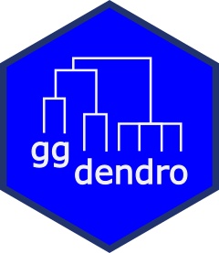

<!-- README.md is generated from README.Rmd. Please edit that file -->

```{r, include = FALSE}
knitr::opts_chunk$set(
  collapse = TRUE,
  comment = "#>",
  fig.path = "man/figures/README-",
  out.width = "100%"
)
```

# ggdendro 


Provides functions for creating dendrograms and tree plots using `ggplot2`.


<!-- badges: start -->
[](https://CRAN.R-project.org/package=ggdendro)
[](https://github.com/andrie/ggdendro/actions/workflows/R-CMD-check.yaml)
[](http://www.r-pkg.org/pkg/ggdendro)
[](https://app.codecov.io/gh/andrie/ggdendro?branch=main)
[](https://www.repostatus.org/#inactive)
<!-- badges: end -->


The `ggdendro` package offers a generic function to extract data and text from the various clustering models:

* `dendro_data()` extracts cluster information from the model object, e.g. cluster allocation, line segment data or label data.

The `dendro_data` object has methods for the following classes:

* `tree`
* `hclust`
* `dendrogram`
* `rpart`

These methods create an object of class `dendro`, which is essentially a list of data frames.  To extract the relevant data frames from the list, use the three accessor functions:

* `segment()` for the line segment data
* `label()` for the text for each end segment
* `leaf_label()` for the leaf labels of a tree diagram


The results of these functions can then be passed to `ggplot()` for plotting.

## Examples

```{r}
library(ggplot2)
library(ggdendro)
hc <- hclust(dist(USArrests), "ave")
hcdata <- dendro_data(hc, type = "rectangle")
ggplot() +
  geom_segment(data = segment(hcdata), 
               aes(x = x, y = y, xend = xend, yend = yend)
  ) +
  geom_text(data = label(hcdata), 
            aes(x = x, y = y, label = label, hjust = 0), 
            size = 3
  ) +
  coord_flip() +
  scale_y_reverse(expand = c(0.2, 0))

### demonstrate plotting directly from object class hclust
ggdendrogram(hc)
ggdendrogram(hc, rotate = TRUE)

### demonstrate converting hclust to dendro using dendro_data first
hcdata <- dendro_data(hc)
ggdendrogram(hcdata, rotate = TRUE) +
  labs(title = "Dendrogram in ggplot2")
```
	    
# Use `dendextend` instead

Most of the functionality in `ggdendro` is included in the excellent `dendextend` package.  In most cases, if you need additional functionality, please use the `dendextend` package instead.

The `ggdendro` package will only get minimal maintenance in future.

Refer to <https://cran.r-project.org/web/packages/dendextend/index.html>

