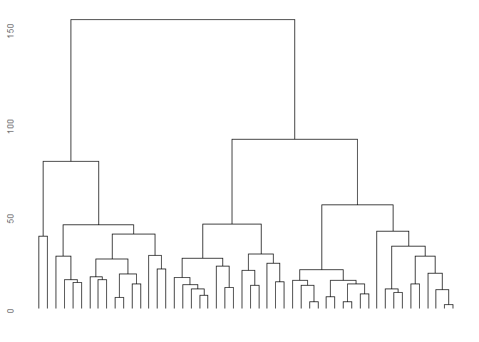
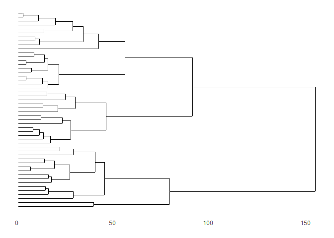
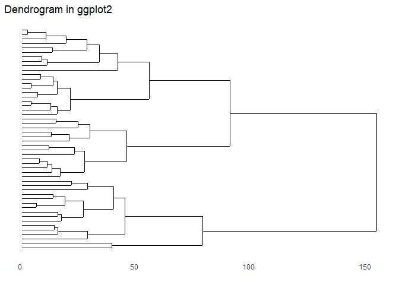

<!-- README.md is generated from README.Rmd. Please edit that file -->

# ggdendro

Provides functions for creating dendrograms and tree plots using
`ggplot2`.

<!-- badges: start -->

[](https://github.com/andrie/ggdendro/actions)
[](http://www.repostatus.org/#active)
[](http://cran.r-project.org/package=ggdendro)
[](http://www.r-pkg.org/pkg/ggdendro)
<!-- badges: end -->

The `ggdendro` package offers a generic function to extract data and
text from the various clustering models:

  - `dendro_data()` extracts cluster information from the model object,
    e.g. cluster allocation, line segment data or label data.

The `dendro_data` object has methods for the following classes:

  - `tree`
  - `hclust`
  - `dendrogram`
  - `rpart`

These methods create an object of class `dendro`, which is essentially a
list of data frames. To extract the relevant data frames from the list,
use the three accessor functions:

  - `segment()` for the line segment data
  - `label()` for the text for each end segment
  - `leaf_label()` for the leaf labels of a tree diagram

The results of these functions can then be passed to `ggplot()` for
plotting.

## Example

``` r
library(ggplot2)
library(ggdendro)
hc <- hclust(dist(USArrests), "ave")
hcdata <- dendro_data(hc, type = "rectangle")
ggplot() +
  geom_segment(data = segment(hcdata), 
               aes(x = x, y = y, xend = xend, yend = yend)
  ) +
  geom_text(data = label(hcdata), 
            aes(x = x, y = y, label = label, hjust = 0), 
            size = 3
  ) +
  coord_flip() +
  scale_y_reverse(expand = c(0.2, 0))
```


``` r

### demonstrate plotting directly from object class hclust
ggdendrogram(hc)
```



``` r
ggdendrogram(hc, rotate = TRUE)
```



``` r

### demonstrate converting hclust to dendro using dendro_data first
hcdata <- dendro_data(hc)
ggdendrogram(hcdata, rotate = TRUE) +
  labs(title = "Dendrogram in ggplot2")
```


