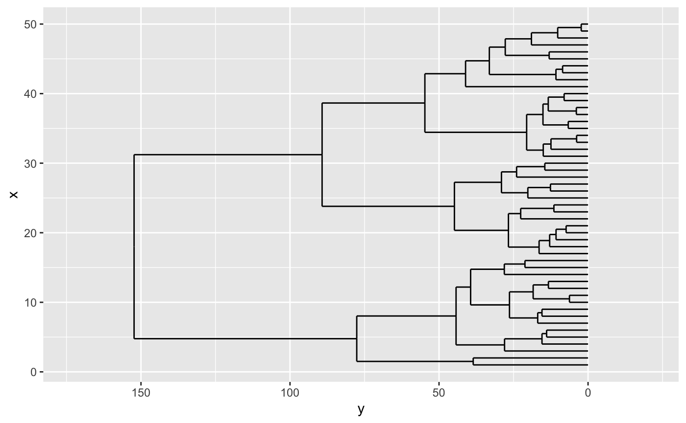
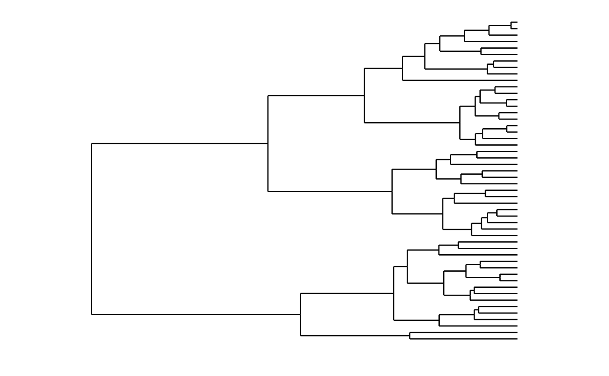
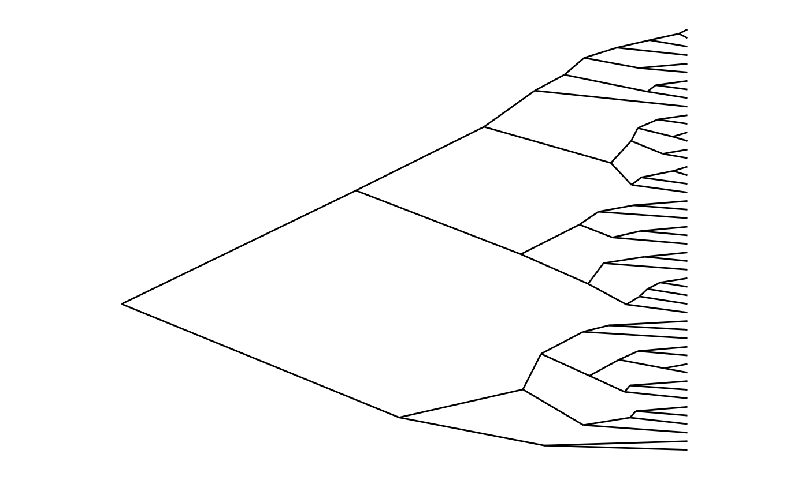
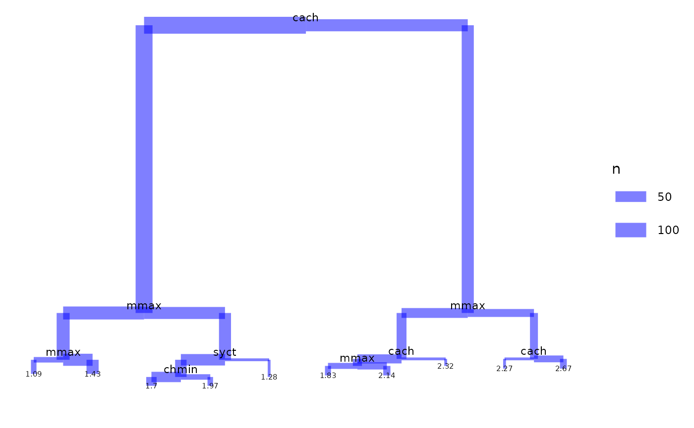
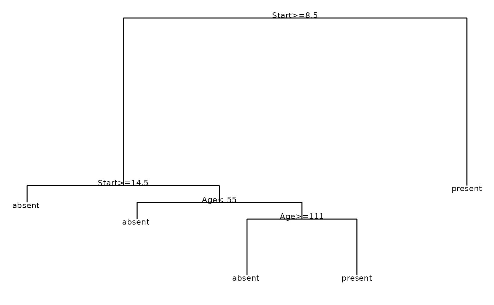
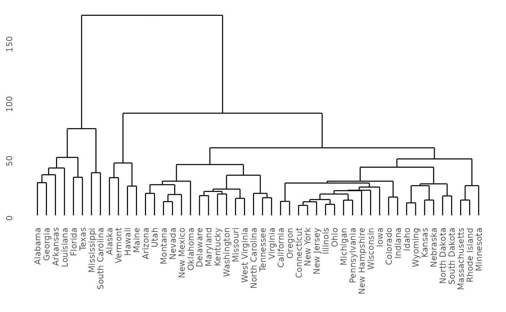

# Using 'ggdendro' to plot dendrograms

The `ggdendro` package makes it easy to extract dendrogram and tree
diagrams into a list of data frames. You can then use this list to
recreate these types of plots using the `ggplot2` package.

## Introduction

The `ggdendro` package provides a general framework to extract the plot
data for dendrograms and tree diagrams.

It does this by providing generic function
[`dendro_data()`](../reference/dendro_data.md) that extracts the
appropriate segment and label data, returning the data as a list of data
frames.

You can access these data frames using three accessor functions:

- [`segment()`](../reference/segment.md)
- [`label()`](../reference/segment.md)
- [`leaf_label()`](../reference/segment.md)

The package also provides two convenient wrapper functions:

- [`ggdendrogram()`](../reference/ggdendrogram.md) is a wrapper around
  [`ggplot()`](https://ggplot2.tidyverse.org/reference/ggplot.html) to
  create a dendrogram using a single line of code. The resulting object
  is of class `ggplot`, so can be manipulated using the `ggplot2` tools.
- [`theme_dendro()`](../reference/theme_dendro.md) is a `ggplot2` theme
  with a blank canvas, i.e. no axes, axis labels or tick marks.

The `ggplot2` package doesn’t get loaded automatically, so remember to
load it first:

``` r
library(ggplot2)
library(ggdendro)
```

## Using the ‘ggdendrogram()’ wrapper

The `ggdendro` package extracts the plot data from dendrogram objects.
Sometimes it is useful to have fine-grained control over the plot. Other
times it might be more convenient to have a simple wrapper around
[`ggplot()`](https://ggplot2.tidyverse.org/reference/ggplot.html) to
produce a dendrogram with a small amount of code.

The function [`ggdendrogram()`](../reference/ggdendrogram.md) provides
such a wrapper to produce a plot with a single line of code. It provides
a few options for controlling the display of line segments, labels and
plot rotation (rotated by 90 degrees or not).

``` r
hc <- hclust(dist(USArrests), "ave")
ggdendrogram(hc, rotate = FALSE, size = 2)
```


The next section shows how to take full control over the data extraction
and subsequent plotting.

## Extracting the dendrogram plot data using ‘dendro_data()’

The [`hclust()`](https://rdrr.io/r/stats/hclust.html) and `dendrogram()`
functions in R makes it easy to plot the results of hierarchical cluster
analysis and other dendrograms in R. However, it is hard to extract the
data from this analysis to customize these plots, since the
[`plot()`](https://rdrr.io/r/graphics/plot.default.html) functions for
both these classes prints directly without the option of returning the
plot data.

``` r
model <- hclust(dist(USArrests), "ave")
dhc <- as.dendrogram(model)
# Rectangular lines
ddata <- dendro_data(dhc, type = "rectangle")
p <- ggplot(segment(ddata)) + 
  geom_segment(aes(x = x, y = y, xend = xend, yend = yend)) + 
  coord_flip() + 
  scale_y_reverse(expand = c(0.2, 0))
p
```



Of course, using `ggplot2` to create the dendrogram means one has full
control over the appearance of the plot. For example, here is the same
data, but this time plotted horizontally with a clean background. In
`ggplot2` this means passing a number of options to `theme`. The
`ggdendro` packages exports a function,
[`theme_dendro()`](../reference/theme_dendro.md) that wraps these
options into a convenient function.

``` r
p + 
  coord_flip() + 
  theme_dendro()
#> Coordinate system already present.
#> ℹ Adding new coordinate system, which will replace the existing one.
```



You can also draw dendrograms with triangular line segments (instead of
rectangular segments). For example:

``` r
ddata <- dendro_data(dhc, type = "triangle")
ggplot(segment(ddata)) + 
  geom_segment(aes(x = x, y = y, xend = xend, yend = yend)) + 
  coord_flip() + 
  scale_y_reverse(expand = c(0.2, 0)) +
  theme_dendro()
```



## Regression tree diagrams

The [`tree()`](https://rdrr.io/pkg/tree/man/tree.html) function in
package `tree` creates tree diagrams. To extract the plot data for these
diagrams using `ggdendro`, you use the the same idiom as for plotting
dendrograms:

``` r
if(require(tree)){
  data(cpus, package = "MASS")
  model <- tree(log10(perf) ~ syct + mmin + mmax + cach + chmin + chmax, 
                data = cpus)
  tree_data <- dendro_data(model)
  ggplot(segment(tree_data)) +
    geom_segment(aes(x = x, y = y, xend = xend, yend = yend, size = n), 
                 colour = "blue", alpha = 0.5) +
    scale_size("n") +
    geom_text(data = label(tree_data), 
              aes(x = x, y = y, label = label), vjust = -0.5, size = 3) +
    geom_text(data = leaf_label(tree_data), 
              aes(x = x, y = y, label = label), vjust = 0.5, size = 2) +
    theme_dendro()
}
#> Loading required package: tree
#> Warning: Using `size` aesthetic for lines was deprecated in ggplot2 3.4.0.
#> ℹ Please use `linewidth` instead.
#> This warning is displayed once every 8 hours.
#> Call `lifecycle::last_lifecycle_warnings()` to see where this warning was
#> generated.
```



## Classification tree diagrams

The [`rpart()`](https://rdrr.io/pkg/rpart/man/rpart.html) function in
package `rpart` creates classification diagrams. To extract the plot
data for these diagrams using `ggdendro` follows the same basic pattern
as dendrograms:

``` r
if(require(rpart)){
  model <- rpart(Kyphosis ~ Age + Number + Start, 
                 method = "class", data = kyphosis)
  ddata <- dendro_data(model)
  ggplot() + 
    geom_segment(data = ddata$segments, 
                 aes(x = x, y = y, xend = xend, yend = yend)) + 
    geom_text(data = ddata$labels, 
              aes(x = x, y = y, label = label), size = 3, vjust = 0) +
    geom_text(data = ddata$leaf_labels, 
              aes(x = x, y = y, label = label), size = 3, vjust = 1) +
    theme_dendro()
}
#> Loading required package: rpart
```



## Twins diagrams: ‘agnes’ and ‘diana’

The `cluster` package allows you to draw `agnes` and `diana` diagrams.

``` r
if(require(cluster)){
  model <- agnes(votes.repub, metric = "manhattan", stand = TRUE)
  dg <- as.dendrogram(model)
  ggdendrogram(dg)
  
  model <- diana(votes.repub, metric = "manhattan", stand = TRUE)
  dg <- as.dendrogram(model)
  ggdendrogram(dg)
}
#> Loading required package: cluster
```



## Summary

The `ggdendro` package makes it easy to extract the line segment and
label data from `hclust`, `dendrogram` and `tree` objects.
