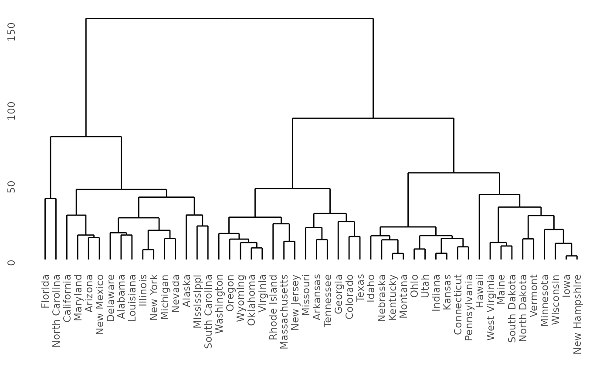
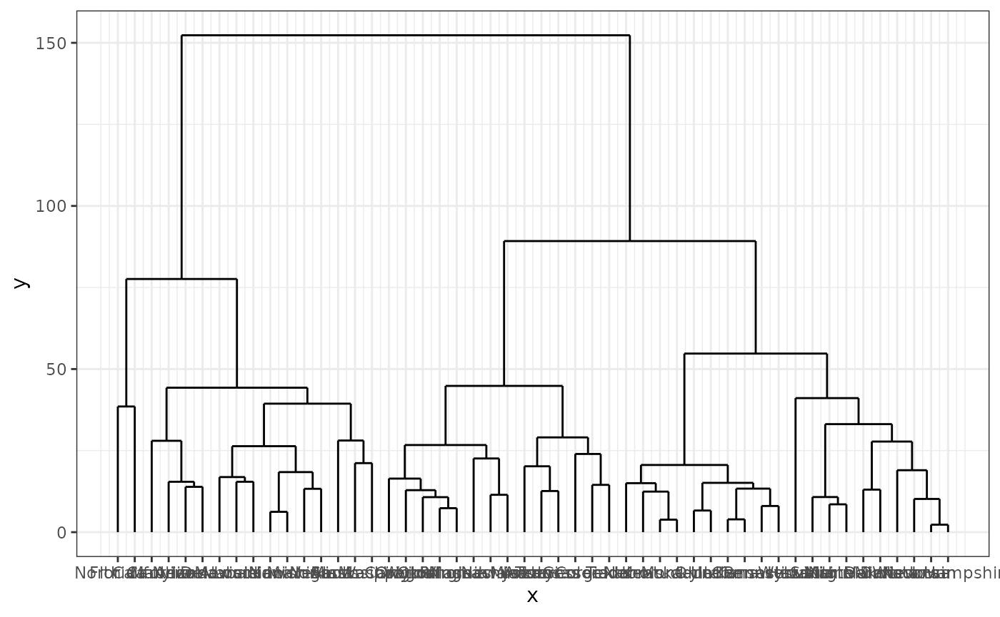
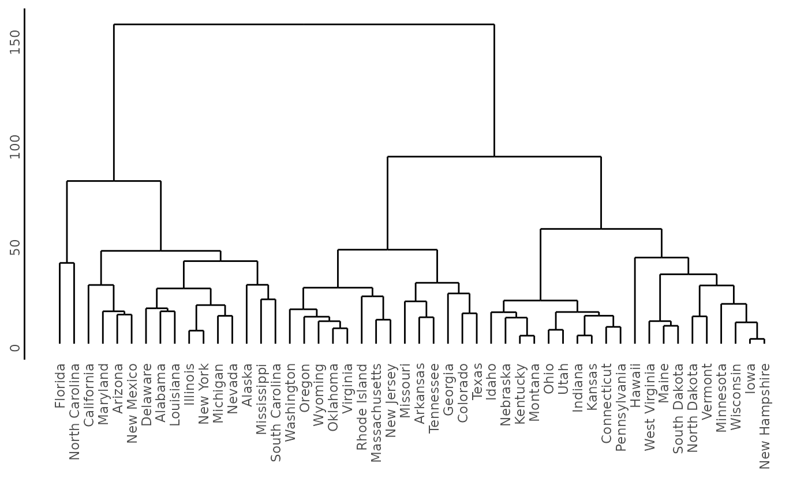

# Modifying ggdendogram output

If you use [`ggdendrogram()`](../reference/ggdendrogram.md) to create
your plot, the resulting object is a `ggplot`. You have full control
over this using any function available in `ggplot`.

First create an example dataset.

``` r
library(ggdendro)
library(ggplot2)
hc <- hclust(dist(USArrests), "ave")
```

Plot the default [`ggdendrogram()`](../reference/ggdendrogram.md)
output:

``` r
ggdendrogram(hc, rotate = FALSE, size = 2)
```



Use a different theme:

``` r
ggdendrogram(hc, rotate = FALSE, size = 2) +
  theme_bw()
```



Or modify just one element, for example add a y-axis.

``` r
ggdendrogram(hc, rotate = FALSE, size = 2) +
  theme( axis.line.y = element_line() )
```



In summary, [`ggdendrogram()`](../reference/ggdendrogram.md) is a
convenience function that creates a `ggplot`. Once you have this plot,
you can modify the plot using tools that you are familiar with.
